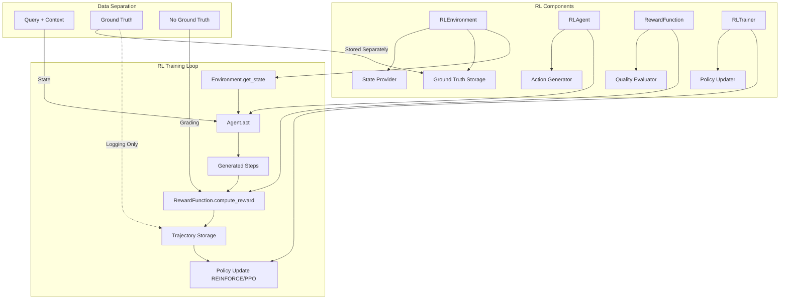
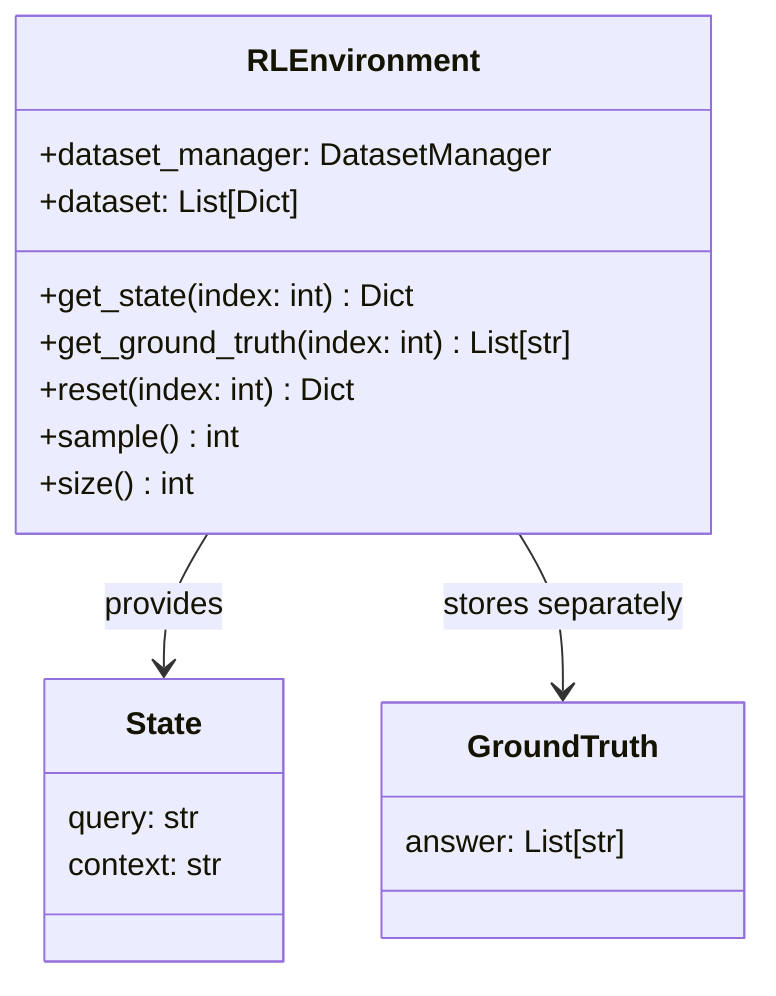
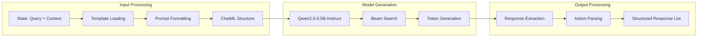
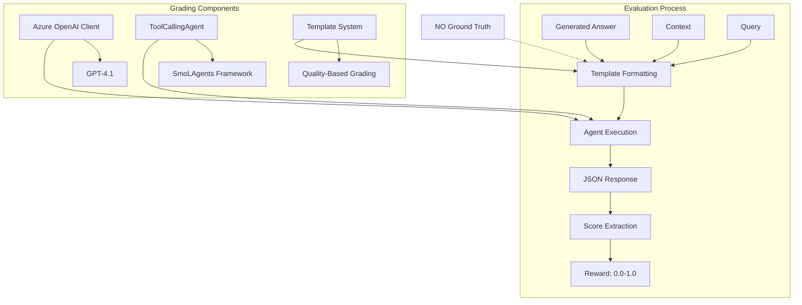
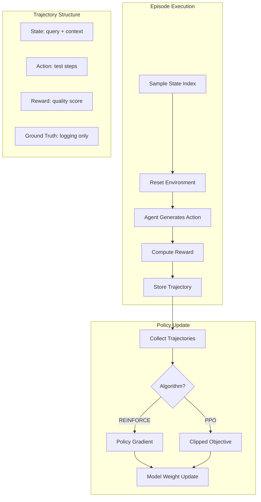
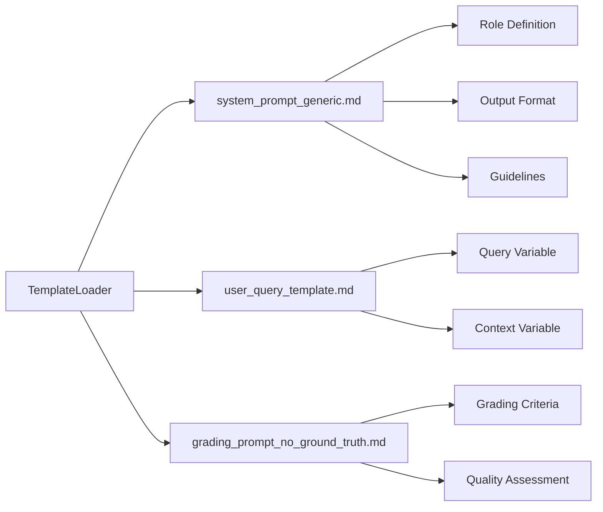
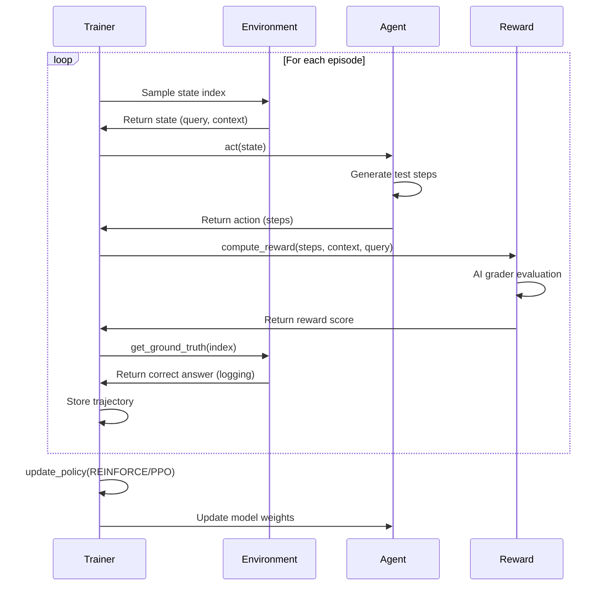

# RL-Based Structured Response Generation System

## Complete Implementation Guide

---

## 🎯 Executive Summary

This system implements a **pure reinforcement learning approach** for training language models to generate structured responses from fact-based question-answering datasets. The solution uses the Qwen language model as the RL agent and Azure OpenAI GPT-4.1 as an independent reward evaluator, creating a domain-agnostic learning system that improves through interaction rather than supervised training.

### Key Innovation

- **Domain-Agnostic Architecture**: Works with any fact-based QNA dataset (test cases, procedures, instructions, etc.)
- **Pure RL Learning**: Agent learns from quality rewards without ground truth in prompts
- **Separation of Concerns**: States, actions, and rewards are cleanly separated
- **Independent Evaluation**: AI-based reward function assesses quality without comparison
- **Template-Based Prompts**: Zero data embedding - instructions only
- **Policy Gradient Learning**: REINFORCE and PPO algorithms for continuous improvement

---

## 🏗️ System Architecture



---

## 📋 Core RL Components

### 1. RL Environment 🌍

**Purpose**: Provides states and manages ground truth separately from the agent.

#### **Design Philosophy**

- **Clean State Provision**: States contain only observable information (query + context)
- **Separate Ground Truth**: Correct answers stored in environment, not exposed to agent
- **Episode Management**: Handles state resets and sampling

#### **Implementation**



#### **Key Methods**

| Method | Returns | Purpose |
|--------|---------|---------|
| `get_state(index)` | `{query, context}` | Get observable state for agent |
| `get_ground_truth(index)` | `List[str]` | Get correct answer (logging only) |
| `reset(index)` | `{query, context}` | Reset to specific state |
| `sample()` | `int` | Random state index |

#### **Critical Design**

```python
def get_state(self, index: int) -> Dict[str, str]:
    """Get state (query, context) - NO answer included."""
    entry = self.dataset[index]
    return {
        "query": entry["query"],
        "context": entry["context"]
        # Explicitly NO answer here - maintained separately
    }
```

---

### 2. RL Agent 🤖

**Purpose**: Generates structured responses (actions) from queries and context (states) using instruction-only prompts.

#### **Agent Architecture**



#### **Configuration**

| Parameter | Value | Purpose |
|-----------|-------|---------|
| Model | `Qwen2.5-0.5B-Instruct` | Base LLM |
| Max Length | 512 tokens | Input context |
| Max New Tokens | 128 tokens | Generation limit |
| Num Beams | 3 | Beam search |
| Temperature | 0.7 | Sampling diversity |

#### **Action Generation**

```python
def act(self, state: Dict[str, str], max_new_tokens: int = 128) -> List[str]:
    """Generate action from state - NO ground truth access.
    
    Args:
        state: {"query": "...", "context": "..."}
        
    Returns:
        List[str]: Generated structured response (e.g., steps, items, procedures)
    """
    # Build prompt with ONLY instructions
    prompt = self._build_prompt(state["query"], state["context"])
    
    # Generate response
    response = self._generate(prompt, max_new_tokens)
    
    # Parse into structured action
    return self._parse_action(response)
```

#### **Template System**

The agent uses **instruction-only templates** with zero data embedding:

- `system_prompt_generic.md`: Role and output format instructions
- `user_query_template.md`: Query formatting (variables: `{query}`, `{context}`)

**Critical**: No examples, no correct answers, no dataset content in templates.

---

### 3. Reward Function 🎯

**Purpose**: Evaluate action quality using AI grader WITHOUT ground truth comparison.

#### **Reward Architecture**



#### **Grading Criteria**

The AI grader evaluates based on **quality**, not comparison:

| Criterion | Weight | Assessment Method |
|-----------|--------|-------------------|
| Completeness | 40% | Are all necessary items/steps present based on context? |
| Logical Order | 30% | Do items follow an appropriate sequence? |
| Accuracy & Clarity | 30% | Are items actionable, clear, and unambiguous? |

**Note**: These criteria adapt to the domain—what constitutes "complete" or "logical order" depends on the context provided in the dataset.

#### **Key Difference from Traditional Grading**

```python
def compute_reward(self, generated_answer: str, context: str, query: str) -> float:
    """Compute reward using AI grader - NO ground truth in prompt.
    
    Evaluates quality based on:
    - Context requirements
    - Query intent
    - Quality criteria
    
    Does NOT compare to correct answer.
    """
    prompt = self.template_loader.format_template(
        "grading_prompt_no_ground_truth",
        generated_answer=generated_answer,
        context=context,
        query=query
        # NO correct_answer parameter
    )
```

#### **Grading Template Structure**

The `grading_prompt_no_ground_truth.md` template instructs the grader to:

1. Assess completeness based on context requirements
2. Evaluate logical ordering for the business process
3. Check clarity and actionability
4. Provide systematic scoring with deductions
5. Return JSON with analysis and accuracy score

**Important**: The grader evaluates independently without seeing the "correct" answer.

---

### 4. RL Trainer 🔄

**Purpose**: Implement policy-based RL algorithms for agent improvement.

#### **Training Architecture**



#### **Training Methods**

##### **Episode Training**

```python
def train_episode(self, episode_index: int) -> Dict:
    """Run single RL episode.
    
    Returns:
        Trajectory with state, action, reward, ground_truth (logging)
    """
    # 1. Get state (NO answer)
    state = self.env.reset(episode_index)
    
    # 2. Agent generates action
    action = self.agent.act(state)
    
    # 3. Ground truth from environment (logging only)
    ground_truth = self.env.get_ground_truth(episode_index)
    
    # 4. Compute reward (NO ground truth in prompt)
    reward = self.reward_fn.compute_reward(
        generated_answer=self._format_action(action),
        context=state["context"],
        query=state["query"]
    )
    
    # 5. Store trajectory
    return {
        "state": state,
        "action": action,
        "reward": reward,
        "ground_truth": ground_truth  # For validation only
    }
```

##### **Policy Update**

```python
def update_policy(self, algorithm: str = "REINFORCE", learning_rate: float = 5e-5):
    """Update agent policy from collected trajectories.
    
    Algorithms:
        - REINFORCE: Policy gradient with returns
        - PPO: Proximal Policy Optimization with clipped objective
    """
```

#### **Supported Algorithms**

| Algorithm | Method | Status |
|-----------|--------|--------|
| **REINFORCE** | Policy gradient: `∇J(θ) = E[∇log π(a|s) * G]` | Placeholder |
| **PPO** | Clipped objective: `L(θ) = E[min(r(θ)A, clip(r(θ))A)]` | Placeholder |

**Note**: Current implementation provides the infrastructure. Full policy gradient computation requires tracking log probabilities during generation.

---

### 5. Template System 📄

**Purpose**: Manage instruction-only prompts with zero data embedding.

#### **Design Philosophy**

Unlike traditional template systems, this loader:

- **NO dataset content**: No examples, no correct answers, no few-shot learning
- **Instructions only**: Pure role definitions and formatting rules
- **Simple substitution**: Only basic variables like `{query}`, `{context}`

#### **Template Structure**



#### **Available Templates**

| Template | Purpose | Variables |
|----------|---------|-----------|
| `system_prompt_generic.md` | Agent role and instructions | None |
| `user_query_template.md` | Query formatting | `{query}`, `{context}` |
| `grading_prompt_no_ground_truth.md` | Reward evaluation | `{generated_answer}`, `{context}`, `{query}` |

#### **Implementation**

```python
class TemplateLoader:
    """Simplified template loader - no data embedding."""
    
    def load_template(self, template_name: str) -> str:
        """Load template content without examples."""
        
    def format_template(self, template_name: str, **kwargs) -> str:
        """Format with simple variable substitution only."""
```

---

## 🔄 RL Training Pipeline

### Complete Training Flow



### Training Statistics

After each batch of episodes, the trainer provides:

```python
{
    "num_episodes": 5,
    "average_reward": 0.742,
    "max_reward": 0.95,
    "min_reward": 0.45
}
```

---

## 📊 Dataset Structure

### General Format

The system works with **any fact-based question-answering dataset** where:

- Questions have definitive, structured answers
- Context provides domain-specific information
- Answers can be represented as ordered lists

### Dataset Schema

```json
[
  {
    "query": "Question or instruction",
    "context": "Domain-specific context or requirements",
    "answer": "[\"Response item 1\", \"Response item 2\", \"Response item 3\"]"
  }
]
```

### Field Descriptions

| Field | Type | Purpose | Access |
|-------|------|---------|--------|
| `query` | string | User's question/instruction | State (agent sees) |
| `context` | string | Domain context/requirements | State (agent sees) |
| `answer` | JSON array string | Correct structured response | Ground truth (env only) |

### Example: QA Test Case Generation

```json
[
  {
    "query": "How to login?",
    "context": "E-commerce login system with username/password authentication",
    "answer": "[\"Enter username\", \"Enter password\", \"Click login\"]"
  },
  {
    "query": "How to add item to cart?",
    "context": "Online shopping platform with product catalog",
    "answer": "[\"Select product\", \"Choose quantity\", \"Click add to cart\"]"
  }
]
```

### Example: Cooking Instructions

```json
[
  {
    "query": "How to make scrambled eggs?",
    "context": "Basic breakfast cooking with standard kitchen equipment",
    "answer": "[\"Crack eggs into bowl\", \"Whisk with fork\", \"Heat pan with butter\", \"Pour eggs in pan\", \"Stir continuously\", \"Remove when fluffy\"]"
  }
]
```

### Example: Troubleshooting Procedures

```json
[
  {
    "query": "How to fix slow internet connection?",
    "context": "Home WiFi network with router and modem",
    "answer": "[\"Restart router\", \"Check cable connections\", \"Run speed test\", \"Contact ISP if issue persists\"]"
  }
]
```

### Example: Learning Procedures

```json
[
  {
    "query": "How to solve quadratic equations?",
    "context": "High school algebra curriculum",
    "answer": "[\"Write equation in standard form\", \"Identify a, b, c coefficients\", \"Apply quadratic formula\", \"Simplify results\"]"
  }
]
```

### Critical Design

- **Agent sees**: `query` + `context` (state)
- **Agent never sees**: `answer` (ground truth)
- **Reward function sees**: Generated answer + `context` + `query` (NO ground truth)
- **Environment stores**: All three fields separately

### Domain Applicability

This system works well for domains requiring:

- ✅ Sequential steps or procedures
- ✅ Ordered lists of items
- ✅ Structured responses
- ✅ Fact-based answers (not creative/subjective)

Examples:

- Test case generation
- Cooking recipes
- Assembly instructions
- Troubleshooting guides
- Standard operating procedures
- Tutorial steps
- Checklists
- Process documentation

---

## 🚀 Usage Guide

### Installation

```bash
# Install dependencies
pip install torch transformers datasets smolagents openai python-dotenv

# Set environment variables
export AOAI_API_KEY="your-azure-openai-key"
export AOAI_ENDPOINT="your-azure-openai-endpoint"
```

### Basic Usage

```python
from src.environment import RLEnvironment
from src.agent import RLAgent
from src.reward import RewardFunction
from src.trainer import RLTrainer

# Initialize RL components with your dataset
env = RLEnvironment("your_dataset.json")  # Any fact-based QNA dataset
agent = RLAgent(model_name="Qwen/Qwen2.5-0.5B-Instruct")
reward_fn = RewardFunction()
trainer = RLTrainer(agent, env, reward_fn)

# Train on episodes
for episode in range(5):
    index = env.sample()
    trajectory = trainer.train_episode(index)
    print(f"Episode {episode}: Reward = {trajectory['reward']:.3f}")

# Update policy
trainer.update_policy(algorithm="REINFORCE", learning_rate=5e-5)

# Get statistics
stats = trainer.get_statistics()
print(f"Average Reward: {stats['average_reward']:.3f}")
```

### Running the Demo

The included demo uses QA test case generation as an example scenario:

```bash
# Run main pipeline with test case dataset
python -m src.main

# Validate structure
python -m src.validate_refactor
```

### Using Your Own Dataset

1. **Create Dataset File**: Format as JSON with `query`, `context`, `answer` fields
2. **Point to Dataset**: `env = RLEnvironment("path/to/your/dataset.json")`
3. **Run Training**: Use the same training code - no modifications needed
4. **Optional Template Customization**: Adjust `system_prompt_generic.md` for domain-specific terminology

---

## 🎯 Key Design Principles

### 1. Clean Separation of Data and Prompts

**Problem**: Traditional systems embed dataset content in prompts (examples, correct answers)

**Solution**:

- Templates contain ONLY instructions
- Agent never sees ground truth
- Reward function evaluates quality independently

### 2. True RL Paradigm

**State → Action → Reward → Policy Update**

```
State: {query, context}
↓
Action: Agent generates test steps
↓
Reward: AI grader evaluates quality (no comparison)
↓
Policy Update: REINFORCE/PPO improves generation
```

### 3. Independent Quality Evaluation

**Traditional Approach**: Compare generated output to correct answer

**Our Approach**: Evaluate quality based on:

- Completeness for the context
- Logical ordering for the process
- Clarity and actionability

This allows the system to potentially discover better solutions than the ground truth.

### 4. Modular Architecture

Each component has a single responsibility:

- **Environment**: State management + ground truth storage
- **Agent**: Action generation from states
- **Reward**: Quality evaluation
- **Trainer**: Policy optimization

---

## 📈 Performance Metrics

### Reward-Based Metrics

Since this is an RL system, success is measured by:

| Metric | Description | Target |
|--------|-------------|--------|
| **Average Reward** | Mean reward across episodes | ≥ 0.80 |
| **Reward Variance** | Consistency of performance | Low variance |
| **Max Reward** | Best episode performance | ≥ 0.90 |
| **Learning Curve** | Reward improvement over time | Upward trend |

### Quality Dimensions

The AI grader evaluates on:

1. **Completeness (40%)**: All necessary items present for the domain/context
2. **Order (30%)**: Logical sequence appropriate for the task
3. **Clarity (30%)**: Actionable, unambiguous, and well-articulated

These dimensions are applied consistently across all domains, with the grader interpreting "completeness" and "order" based on the specific context provided.

---

## 🔬 Extending the System

### Adapting to New Domains

The system is **domain-agnostic by design**. To use with a new domain:

1. **Create Domain Dataset**:

   ```json
   [
     {
       "query": "Your domain-specific question",
       "context": "Domain requirements/context",
       "answer": "[\"Item 1\", \"Item 2\", \"Item 3\"]"
     }
   ]
   ```

2. **Load and Train** (no code changes needed):

   ```python
   env = RLEnvironment("your_domain_dataset.json")
   agent = RLAgent()
   reward_fn = RewardFunction()
   trainer = RLTrainer(agent, env, reward_fn)
   trainer.train_episode(0)
   ```

3. **Optional Customization**:
   - Update `system_prompt_generic.md` for domain-specific terminology
   - Modify `grading_prompt_no_ground_truth.md` for domain-specific quality criteria

### Example Domain Adaptations

#### Software Development

```json
{
  "query": "How to implement binary search?",
  "context": "Python programming for sorted array",
  "answer": "[\"Define function with array and target\", \"Initialize left and right pointers\", \"While loop until pointers meet\", \"Calculate mid point\", \"Compare mid value to target\", \"Adjust pointers\", \"Return result\"]"
}
```

#### Medical Procedures

```json
{
  "query": "How to perform CPR?",
  "context": "Emergency response for unconscious adult patient",
  "answer": "[\"Check responsiveness\", \"Call emergency services\", \"Position patient on back\", \"Place hands on center of chest\", \"Compress 2 inches deep at 100-120 bpm\", \"Give rescue breaths if trained\", \"Continue until help arrives\"]"
}
```

#### DIY Instructions

```json
{
  "query": "How to install a ceiling fan?",
  "context": "Residential electrical work with standard ceiling box",
  "answer": "[\"Turn off circuit breaker\", \"Remove old fixture\", \"Install mounting bracket\", \"Connect wires\", \"Attach fan motor\", \"Install blades\", \"Test operation\"]"
}
```

#### Customer Service

```json
{
  "query": "How to process a refund request?",
  "context": "E-commerce platform with 30-day return policy",
  "answer": "[\"Verify purchase date\", \"Check return policy eligibility\", \"Request return reason\", \"Issue RMA number\", \"Provide shipping label\", \"Process refund upon receipt\"]"
}
```

### Applicable Domains

This system excels at domains with:

| ✅ Good Fit | ❌ Poor Fit |
|------------|------------|
| Procedural knowledge | Creative writing |
| Ordered sequences | Subjective opinions |
| Fact-based responses | Open-ended discussions |
| Structured workflows | Unstructured narratives |
| Step-by-step guides | Poetry or prose |
| Checklists | Emotional content |
| Instructions | Philosophical debates |

### To New RL Algorithms

1. **Implement Algorithm**: Add method to `RLTrainer`
2. **Track Log Probabilities**: Modify `Agent.act()` to return log probs
3. **Compute Gradients**: Implement policy gradient calculation
4. **Update Weights**: Apply gradient updates to model

---

## 🎯 Use Cases

### Current Demo: QA Test Case Generation

**Domain**: Software quality assurance  
**Query Type**: "How to [perform action]?"  
**Response**: Ordered test steps

### Other Applications

1. **Process Documentation**
   - Manufacturing procedures
   - Standard operating procedures (SOPs)
   - Compliance checklists

2. **Educational Content**
   - Tutorial steps
   - Learning sequences
   - Problem-solving procedures

3. **Technical Support**
   - Troubleshooting guides
   - Diagnostic procedures
   - Resolution workflows

4. **Recipe Generation**
   - Cooking instructions
   - Assembly guides
   - Preparation sequences

5. **Administrative Workflows**
   - Onboarding procedures
   - Form processing steps
   - Approval workflows

All that's needed is a dataset in the standard format—the RL system handles the rest.

---

## 🏛️ Architecture Decisions

### Why Pure RL?

**Advantages**:

- ✅ No supervised learning bias
- ✅ Can discover novel solutions
- ✅ Continuous improvement from interaction
- ✅ Adaptable to changing requirements

**Trade-offs**:

- ⚠️ Slower initial learning
- ⚠️ Requires more episodes
- ⚠️ Needs good reward function

### Why Separate Ground Truth?

**Benefits**:

- ✅ Agent learns from quality, not imitation
- ✅ Reward function evaluates independently
- ✅ Clean RL paradigm
- ✅ Prevents data leakage

### Why AI Grader?

**Rationale**:

- ✅ Captures nuanced quality aspects
- ✅ More flexible than exact match
- ✅ Domain-adaptable evaluation
- ✅ Provides rich feedback signal

---

## 📚 Technical Details

### Model Architecture

```
Qwen2.5-0.5B-Instruct
├── Embedding Layer (vocab_size)
├── Transformer Blocks (24 layers)
├── Layer Normalization
└── LM Head (output projection)
```

### Grader Architecture

```
Azure OpenAI GPT-4.1
├── Tool Calling Agent (SmoLAgents)
├── Template-Based Prompts
├── JSON Response Parsing
└── Score Normalization [0.0, 1.0]
```

### Training Configuration

```python
# REINFORCE (placeholder)
learning_rate = 5e-5
num_episodes = 5
policy_update = "gradient ascent on log_prob * return"

# PPO (placeholder)
learning_rate = 5e-5
clip_epsilon = 0.2
num_episodes = 5
policy_update = "clipped objective"
```

---

## 🔍 Validation

The system includes comprehensive validation:

```bash
python -m src.validate_refactor
```

**Checks**:

- ✅ File structure completeness
- ✅ Dataset format validity
- ✅ Template content (no ground truth variables)
- ✅ Import syntax and dependencies

---

## 🎓 Learning Resources

### RL Concepts

- **State**: Observable information (query + context)
- **Action**: Generated test steps
- **Reward**: Quality score from AI grader
- **Policy**: Agent's strategy for generating actions
- **Trajectory**: Sequence of (state, action, reward)
- **Policy Gradient**: Method to improve policy using gradients

### Algorithms

- **REINFORCE**: Monte Carlo policy gradient
  - Pros: Simple, unbiased
  - Cons: High variance
  
- **PPO**: Proximal Policy Optimization
  - Pros: More stable, lower variance
  - Cons: More complex

---

## 🚧 Current Limitations & Future Work

### Current State

- ✅ RL infrastructure complete
- ✅ Clean data separation
- ✅ Independent reward evaluation
- ⚠️ Policy update algorithms are placeholders

### Future Enhancements

1. **Full REINFORCE Implementation**
   - Track log probabilities during generation
   - Compute policy gradients
   - Implement gradient ascent

2. **PPO Implementation**
   - Compute advantage estimates
   - Implement clipped objective
   - Value function training

3. **Advanced Features**
   - Experience replay buffer
   - Baseline subtraction for variance reduction
   - Multi-step returns
   - Parallel environment execution

---

## 📝 Project Structure

```
.
├── src/
│   ├── __init__.py
│   ├── environment.py          # RL Environment
│   ├── agent.py                # RL Agent
│   ├── reward.py               # Reward Function
│   ├── trainer.py              # RL Trainer
│   ├── template_loader.py      # Template System
│   ├── main.py                 # Main Pipeline
│   ├── validate_refactor.py    # Validation Script
│   └── templates/
│       ├── system_prompt_generic.md
│       ├── user_query_template.md
│       └── grading_prompt_no_ground_truth.md
├── sample_dataset.json         # Demo Dataset
├── requirements.txt            # Dependencies
└── README.md                   # This File
```

---

## 🤝 Contributing

To extend or improve this system:

1. Maintain separation: States ≠ Ground Truth
2. Keep templates instruction-only
3. Ensure reward function doesn't see ground truth
4. Follow RL paradigm: State → Action → Reward
5. Document design decisions

---

## 📄 License

[Your License Here]

---

## 🙏 Acknowledgments

- **Qwen Team**: For the excellent small language model ideal for RL fine-tuning
- **Azure OpenAI**: For GPT-4.1 grading capabilities across diverse domains
- **SmoLAgents**: For the tool-calling agent framework
- **RL Research Community**: For foundational algorithms (REINFORCE, PPO)
- **Open-Source Community**: For the transformers and datasets libraries

---

*This system demonstrates a clean RL architecture for training language models on structured response generation from fact-based QNA datasets. The domain-agnostic design emphasizes proper separation of concerns and independent quality evaluation without ground truth comparison in prompts. Simply provide your dataset in the standard format, and the system handles learning across any procedural or instructional domain.*
