# Hybrid Learning System: In-Context Learning & (semi) Supervised Fine-Tuning

## Complete Implementation Guide

---

## 🎯 Executive Summary

This system implements a **hybrid learning approach** for automated response generation across any domain, combining in-context learning (few-shot prompting) with supervised fine-tuning. The solution uses the Qwen language model as the primary generator and Azure OpenAI as an external grader to create a robust learning feedback loop.

### Key Innovation

- **Dual Learning Strategy**: In-context learning for immediate improvement + supervised fine-tuning for permanent knowledge acquisition
- **External Grader System**: Uses GPT-4.1 as an independent evaluator
- **Template-Based Architecture**: Modular, maintainable prompt management
- **Context-Aware Generation**: Dynamic adaptation to different business domains
- **Domain Agnostic**: Applicable to any structured response generation task

---

## 🏗️ System Architecture


---

## 📋 Component Deep Dive

### 1. Dynamic Template Loader System 📄

The foundation of our modular prompt management system with context-aware capabilities.

#### **Purpose & Design**

- **Separation of Concerns**: Keeps prompts separate from code logic
- **Easy Maintenance**: Modify prompts without code changes
- **Dynamic Variable Substitution**: Context-aware prompt generation
- **Multi-Domain Support**: Business context integration

#### **Implementation Structure**


#### **Template Types & Usage**

| Template Type | Purpose | Variables | Example Usage |
|---------------|---------|-----------|---------------|
| `dynamic_few_shot_prompt` | Context-aware in-context examples | `{context}`, `{example_query}`, `{example_answer}` | Few-shot learning with domain context |
| `system_prompt_regular` | Basic system instructions | None | Standard generation |
| `system_prompt_teaching` | Supervised learning mode | None | Fine-tuning preparation |
| `dynamic_grading_prompt` | Context-aware evaluation | `{context}`, `{correct_answer}`, `{generated_answer}` | Domain-specific grading |
| `context_aware_user_query` | Context-integrated queries | `{query}`, `{context}` | Business domain integration |

#### **Key Methods**

```python
# Load and format context-aware few-shot prompt
prompt = loader.format_few_shot_prompt(
    context="E-commerce domain",
    example_query="How to complete the process?",
    example_answer='["Step 1", "Step 2", "Step 3"]'
)

# Dynamic grading with business context
grading_prompt = loader.format_grading_prompt(
    context="Specific business process",
    correct_answer='["Expected step 1", "Expected step 2"]',
    generated_answer='["Generated step 1", "Generated step 2"]'
)
```

---

### 2. Context-Aware Response Generator 🤖

The core language model responsible for generating structured responses with business context awareness.

#### **Model Architecture**


#### **Configuration Parameters**

| Parameter | Value | Purpose |
|-----------|-------|---------|
| Model | `Qwen2.5-0.5B-Instruct` | Base language model |
| Max Tokens | 512 | Context window limit |
| New Tokens | 128 | Generation limit |
| Beam Search | 3 beams | Diverse generation |
| Temperature | 0.7 | Balanced creativity |
| Format | ChatML | Conversation structure |

#### **Generation Modes**

##### **In-Context Learning Mode** 🎯

```python
# Uses contextual examples for improved performance
result = generator.generate_response(query_data, use_few_shot=True)
```

**Benefits:**

- Immediate performance improvement
- No model weight modifications
- Preserves original capabilities
- Fast iteration cycles
- Context-aware example selection

##### **Regular Mode** 📝

```python
# Standard generation without examples
result = generator.generate_response(query_data, use_few_shot=False)
```

**Use Cases:**

- Baseline performance measurement
- Comparison studies
- General-purpose generation

#### **Context-Aware Processing**

```python
def _prepare_context_prompt(self, query_data: Dict, use_few_shot: bool, few_shot_example: Dict = None) -> tuple[str, str]:
    """Prepare context-aware system and user prompts"""
    query = query_data["query"]
    context = query_data.get("context", "")
    
    if use_few_shot and context:
        # Use dynamic context-aware few-shot prompting
        selected_example = self._select_few_shot_example(query_data)
        system_content = self.template_loader.format_few_shot_prompt(
            context, selected_example["query"], selected_example["answer"]
        )
        user_content = self.template_loader.format_user_query_with_context(query, context)
    else:
        # Standard prompting approach
        system_content = self.template_loader.load_template("system_prompt_regular")
        user_content = self.template_loader.format_template("user_query_template", query=query)
    
    return system_content, user_content
```

#### **Output Structure**

```python
{
    "response": ["Step 1", "Step 2", "Step 3"],
    "raw_text": "Full generated response...",
    "response_text": "Cleaned assistant response...",
    "formatted_answer": '["Step 1", "Step 2", "Step 3"]',
    "context_used": "Business domain context"
}
```

---

### 3. Context-Aware SmoLAgents Grader System 🎯

External evaluation system providing objective, domain-specific performance assessment.

#### **Architecture Overview**


#### **Context-Aware Grading Criteria**

| Aspect | Weight | Description |
|--------|--------|-------------|
| **Domain Accuracy** | 40% | Correctness within business context |
| **Process Completeness** | 30% | Coverage of domain-specific workflow |
| **Terminology Clarity** | 20% | Appropriate domain language usage |
| **Logical Sequence** | 10% | Context-appropriate ordering |

#### **Dynamic Grading Implementation**

```python
def grade_response(self, generated_answer: str, context: str = "", correct_answer: str = "") -> float:
    """Grade with optional context awareness"""
    
    if context and correct_answer:
        # Use dynamic context-aware grading
        prompt = self.template_loader.format_grading_prompt(
            context=context,
            correct_answer=correct_answer,
            generated_answer=generated_answer
        )
    else:
        # Use static grading for backward compatibility
        prompt = self.template_loader.format_template("grading_prompt", generated_answer=generated_answer)
    
    # Process grading request
    result = self.agent.run(prompt)
    return self._extract_accuracy_score(result)
```

---

### 4. In-Context Learning Trainer 🎓

Implements few-shot prompting approach for immediate performance improvement without model modification.

#### **Learning Philosophy**


#### **Training Process**


#### **Context-Aware Example Selection**

```python
def _select_few_shot_example(self, current_query: Dict) -> Dict:
    """Select relevant example from dataset based on context similarity"""
    current_context = current_query.get("context", "").lower()
    current_query_text = current_query.get("query", "").lower()
    
    all_queries = self.dataset_manager.get_all_queries()
    
    # Priority 1: Context keyword overlap
    for example in all_queries:
        example_context = example.get("context", "").lower()
        if self._calculate_context_similarity(current_context, example_context) > 0.3:
            return example
    
    # Priority 2: Query type similarity
    for example in all_queries:
        if self._detect_similar_action_type(current_query_text, example["query"]):
            return example
    
    # Fallback: First available example
    return all_queries[0]
```

#### **Success Metrics**

| Metric | Target | Current Performance |
|--------|--------|-------------------|
| **Context-Aware Exact Matches** | ≥80% | Tracked per domain |
| **High Domain Scores (≥0.9)** | ≥80% | Context-specific evaluation |
| **Cross-Domain Success** | 4/5 tests | Multi-context criteria |
| **Average Context Score** | ≥0.85 | Domain-weighted mean |

---

### 5. Supervised Fine-Tuning Trainer 🔄

Implements supervised learning for permanent knowledge integration with context awareness.

#### **Fine-Tuning Architecture**


#### **Context-Aware Training Configuration**

| Parameter | Value | Rationale |
|-----------|-------|-----------|
| **Epochs** | 3 | Prevent overfitting across domains |
| **Batch Size** | 1 | Memory efficiency with context |
| **Learning Rate** | 5e-5 | Stable cross-domain convergence |
| **Gradient Accumulation** | 4 | Effective batch size |
| **Warmup Steps** | 10 | Smooth domain adaptation |
| **Max Length** | 512 | Context + query preservation |

#### **Multi-Domain Training Example Structure**

```python
{
    "text": "System prompt + Context + User query + Correct answer + EOS",
    "query": "How to complete the process?",
    "context": "Business process with specific requirements",
    "correct_answer": '["Step 1", "Step 2", "Step 3", "Step 4"]',
    "type": "context_aware_example",
    "domain": "business_process"
}
```

#### **Adaptive Training Loop**


---

## 🔄 Hybrid Learning Pipeline

### Complete Learning Flow


### Success Criteria Matrix

| Test Run | Context | Exact Match | Grader Score | Combined Success | Domain Success Rate |
|----------|---------|-------------|--------------|------------------|-------------------|
| Test 1 | Domain A | ✅ | 0.95 | ✅ | 100% (1/1) |
| Test 2 | Domain B | ❌ | 0.85 | ❌ | 50% (1/2) |
| Test 3 | Domain A | ✅ | 0.92 | ✅ | 67% (2/3) |
| Test 4 | Domain C | ✅ | 0.98 | ✅ | 75% (3/4) |
| Test 5 | Domain A | ✅ | 0.91 | ✅ | **80% (4/5)** ✅ |

---

## 📊 Performance Analysis Framework

### Multi-Domain Evaluation Metrics Dashboard


### Learning Progress Tracking

| Metric | Baseline | After In-Context Learning | After Supervised Fine-Tuning | Target |
|--------|----------|---------------------------|-------------------------------|---------|
| Single Domain Match Rate | 20% | 80% | 95% | ≥80% |
| Cross-Domain Match Rate | 15% | 65% | 85% | ≥70% |
| Context-Aware Average Score | 0.35 | 0.85 | 0.92 | ≥0.85 |
| Domain Consistency | Low | Medium | High | Stable |
| Response Time | Fast | Fast | Fast | <2s |

### Success Pattern Analysis


---

## 🎯 Target Performance Goals

### Primary Objectives

| Goal | Target | Measurement |
|------|--------|-------------|
| **Cross-Domain Consistency** | 80% success rate | 4 out of 5 tests across contexts |
| **Context-Aware Accuracy** | Domain-specific perfect match | Context-sensitive matching |
| **Grader Alignment** | High domain-specific scores | ≥0.9 from context-aware evaluator |
| **Real-Time Performance** | Sub-2-second generation | Including context processing |

### Success Definition

```mermaid
flowchart LR
    A[Response + Context] --> B{Context-Aware Exact Match?}
    B -->|Yes| C[SUCCESS ✅]
    B -->|No| D{Domain-Specific Grader Score ≥ 0.9?}
    D -->|Yes| C
    D -->|No| E[FAILURE ❌]
```



**Combined Success Criteria:**

- **Context-Aware Exact Match**: Generated response exactly matches domain-specific target
- **OR High Domain Score**: External grader rates ≥0.9/1.0 with business context
- **Threshold**: 4 out of 5 tests must succeed across different business domains

---

## 📚 Demo Example: QA Test Case Generation

This repository includes a complete demonstration of the hybrid learning system applied to **QA test case generation** for e-commerce processes.

### **Dataset Structure**

The demo uses `sample_dataset.json` with the following structure:

```json
[
  {
    "query": "How to login?",
    "context": "E-commerce login system with username/password authentication",
    "answer": "[\"Enter username\", \"Enter password\", \"Click login\"]"
  },
  {
    "query": "How to add item to cart?",
    "context": "Online shopping platform with product catalog",
    "answer": "[\"Select product\", \"Choose quantity\", \"Click add to cart\"]"
  }
]
```

### **Domain-Specific Features**

| Component | QA Test Case Adaptation |
|-----------|------------------------|
| **Generator Class** | `QwenTestCaseGenerator` - Specialized for generating test steps |
| **Response Format** | JSON arrays of actionable test steps |
| **Context Types** | E-commerce, User Management, Password Reset workflows |
| **Evaluation Criteria** | Step completeness, logical sequence, domain accuracy |
| **Templates** | QA-specific prompt templates in `templates/` directory |

### **Business Contexts Covered**

1. **E-commerce Processes**: Login, cart management, checkout workflows
2. **User Management**: Registration, profile updates, account management
3. **Security Operations**: Password reset, authentication, verification
4. **Search & Discovery**: Product search, filtering, recommendation flows

### **Running the Demo**

```python
# Initialize with dataset for QA test case generation
dataset_manager = DatasetManager("sample_dataset.json")
generator = QwenTestCaseGenerator(dataset_manager=dataset_manager)
grader = SmoLAgentsGrader()

# Run hybrid learning on QA test cases
trainer = FewShotTeachingTrainer(generator, grader, dataset_manager)
results = trainer.train_on_dataset(num_queries=5)
```

### **Extending to Other Domains**

To adapt this system to other domains:

1. **Replace Dataset**: Create domain-specific query/context/answer triplets
2. **Update Templates**: Modify prompt templates for your domain terminology
3. **Adjust Grading**: Configure evaluation criteria for your response format
4. **Customize Parsing**: Adapt response parsing for your output structure

**Example domains**: Code generation, content creation, process documentation, customer service responses, technical troubleshooting, etc.

---

## 🚀 Implementation Highlights

### Key Innovation Points

1. **Hybrid Learning Strategy**
   - In-context learning for immediate domain adaptation
   - Supervised fine-tuning for permanent cross-domain knowledge
   - Graceful fallback between approaches

2. **Context-Aware External Evaluation**
   - Independent grader using domain-specific context
   - Reduces bias through business context integration
   - Provides objective, domain-relevant performance metrics

3. **Dynamic Template-Based Architecture**
   - Context-aware prompt management
   - Easy experimentation with domain-specific approaches
   - Clear separation between business logic and prompts

4. **Multi-Domain Dataset Support**
   - Business context integration
   - Cross-domain example selection
   - Domain-specific performance tracking

### Technical Achievements

- **Hybrid Model Integration**: Seamless Qwen + Azure OpenAI workflow with context awareness
- **Comprehensive Error Handling**: Multi-domain exception management
- **Advanced Performance Tracking**: Domain-specific metrics and cross-context analysis
- **Scalable Design**: Easy extension to new business domains and use cases

---

## 📚 Learning Approaches Summary

### **In-Context Learning (Few-Shot)**

- **What**: Providing examples within the prompt context
- **When**: Immediate performance improvement needed
- **Benefit**: Fast adaptation without model changes
- **Limitation**: Context window constraints

### **Supervised Fine-Tuning**

- **What**: Training model weights on correct examples
- **When**: Permanent knowledge integration required
- **Benefit**: Persistent improvements across sessions
- **Limitation**: Requires computational resources for training

### **Hybrid Approach**

- **Strategy**: Start with in-context learning, escalate to fine-tuning if needed
- **Advantage**: Best of both worlds - speed and permanence
- **Implementation**: Automatic fallback based on performance thresholds

---

*This system represents a flexible, domain-agnostic approach to automated response generation, combining the immediacy of in-context learning with the permanence of supervised fine-tuning to create a robust, context-aware solution for diverse business applications.*
